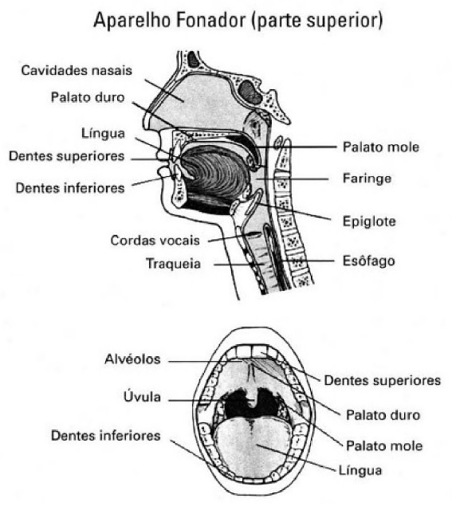
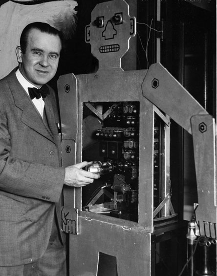

# SOM E SISTEMAS DE RECONHECIMENTO DE FALA

Inicialmente, antes de se falar propriamente do desenvolvimento do modelo de reconhecimento de comandos de voz utilizando o _framework TensorFlow_, é importante realizar uma contextualização sobre a natureza física do som e da produção da fala humana. Dessa forma, neste capítulo serão discutidos os fenômenos físicos do som e da voz humana, além da descrição de um breve histórico dos sistemas de reconhecimento de fala.

## OS FENÔMENOS FÍSICOS DO SOM E DA VOZ HUMANA

De acordo com \citeonline[p. 289]{sears2003fisica}, a definição mais geral de som consiste em dizer que este é uma onda longitudinal — os deslocamentos são paralelos à direção da propagação da onda — se propagando em um meio, geralmente, o ar. 

O ouvido humano possui uma sensibilidade impressionante, capaz de detectar ondas sonoras com uma intensidade muito pequena.

As ondas sonoras mais simples são as senoidais, as quais possuem valores definidos para a amplitude, a frequência e o comprimento de onda. O ouvido humano é sensível aos sons com frequências entre 20 e 20000 Hz.

Por conseguinte, sobre a voz humana, o campo que estuda estes sons como entidades físico-articulatórias isoladas é chamado fonética. Assim, cabe à fonética descrever os sons da linguagem e analisar suas particularidades articulatórias, acústicas e perceptivas. \cite[p. 11]{callou1990iniciação}.

Segundo \citeonline[p. 11]{cavaliere2011pontos} e  \citeonline[p. 18]{cunha1985brevegramatica}, praticamente todos os sons da fala resultam das modificações vibratórias derivadas da ação de certos órgãos sobre a corrente de ar vinda dos pulmões. Para a produção do som, três condições são necessárias:

- A corrente de ar.
- Um obstáculo encontrado por essa corrente de ar.
- Uma caixa de ressonância.

Ainda segundo \citeonline[p. 18]{cunha1985brevegramatica}, estas condições são criadas pelos órgãos da fala denominados, em conjunto, aparelho fonador, que é composto por:

- Pulmões, brônquios e traqueia — órgãos respiratórios que fornecem a corrente de ar, matéria-prima da fonação.
- Laringe, onde se localizam as cordas vocais, que produzem energia sonora utilizada na fala.
- Cavidades supralaríngeas (faringe, boca e fossas nasais), que funcionam como caixas de ressonância, sendo que a cavidade bucal pode variar profundamente de forma e de volume, graças aos movimentos dos órgãos ativos, sobretudo da língua.

Os órgãos do aparelho fonador podem ser vistos na Figura \ref{fig01}.

{#fig01 width=90%}

Fonte: \citeonline[p. 12]{cavaliere2011pontos}

De acordo com \citeonline[p. 12]{cavaliere2011pontos}, a pressão do diafragma e dos músculos da caixa torácica sobre os pulmões provoca a expulsão do ar através dos brônquios e da traqueia até chegar à laringe. 

No topo desse órgão situam-se as cordas vocais, dois pares de membranas superpostos e separados por uma cavidade chamada ventrículo de Morgagni.

Ainda segundo \citeonline[p. 12]{cavaliere2011pontos} produção da voz se atribui exclusivamente ao par de cordas superior e se posicionam como lábios que se abrem para possibilitar a entrada e saída de ar durante a respiração através de uma abertura triangular denominada glote. 

Uma válvula situada na saída da laringe, a epiglote, controla o fechamento da glote para evitar a entrada de saliva e alimentos no aparelho no ato da deglutição.

Ao respirarmos, o ar passa pela glote sem provocar qualquer alteração sonora, já que as cordas estão regularmente afastadas; no entanto, ao emitirmos a voz, as cordas vocais se unem, provocando o fechamento da glote. \cite[p. 12]{cavaliere2011pontos}

A pressão do ar expirado irrompe na glote e provoca a vibração das cordas, de que resulta o efeito acústico vocal.

A natureza física da voz — grave, aguda, rouca, etc. — deve-se a fatores fisiológicos, como a espessura das cordas vocais e a frequência de vibração. As vozes masculinas normalmente resultam de frequências mais baixas do que a das vozes femininas. \cite[p. 12]{cavaliere2011pontos}

Certas qualidades primárias da voz, como o tom, a intensidade e a quantidade, são adquiridas na laringe.

Ainda de acordo com \citeonline[p. 12]{cavaliere2011pontos}, após passar pela glote, o ar percorre o espaço em que se situam a faringe, a boca e as fossas nasais, onde sofre variadas modificações que darão a configuração final dos sons linguísticos. 

Dá-se ao conjunto das modificações impostas à corrente expiratória nas cavidades superiores o nome de articulação.

Por fim, em outros termos, articular um som implica atribuir-lhe um conjunto de características que o distingue dos demais sons, mediante estreitamentos ou oclusões que modulam a corrente de ar nas cavidades faríngea, bucal e nasal.

## HISTÓRICO DOS SISTEMAS DE RECONHECIMENTO DE FALA

A voz transmite muitas informações de quem fala, como estado emocional, gênero e personalidade. O objetivo de um sistema de reconhecimento automático de fala é compreender corretamente o enunciado de um indivíduo para a realização de alguma ação posterior.

De acordo com \apudonline[p. 19]{hugointerface1995}{pierrel1987dialogue}, por volta de 1930, o americano R. J. Wensley construiu o Televox, primeiro autômato capaz de receber ordens por telefone e executar alguns movimentos correspondentes. Uma foto do Televox pode ser visto na Figura \ref{fig02}.

{#fig02 width=70%}

Fonte: \citeonline{history2012robots}

No entanto, os primeiros sistemas de reconhecimento de fala de fato apareceram somente na década de 1950.

Segundo \citeonline[p. 3]{bresolin2008reconhecimento}, na década de 1950 vários pesquisadores tentaram explorar as ideias fundamentais de acústica e fonética. Em 1952, na Bell Labs, \citeonline{davis1952automatic} construíram um sistema para o reconhecimento de dígitos isolados (números de 0 a 9) para um único locutor. 

Nos laboratórios da RCA (_Radio Corporation of America_), \citeonline{olson1956phonetic} tentaram desenvolver um sistema para reconhecer dez sílabas diferentes faladas por uma pessoa.

No final da década de 50, \citeonline{fry1959theoretical} e \citeonline{denes1959design}, pesquisadores da _University College of England_ (Colégio universitário da Inglaterra) construíram um reconhecedor de fonemas para reconhecer quatro vogais e nove consoantes, utilizando um analisador de espectro e uma combinação de padrões para fazer a decisão do reconhecimento. 

Outro esforço notável neste período foi o reconhecedor de vogais de \citeonline{forgie1959results}, construído no MIT (_Michigan Intitute of Tecnology_ – Instituto de Tecnologia de Michigan), no _Lincoln Laboratories_ (Laboratórios Lincoln) em 1959, utilizando um banco de filtros.

De acordo com \citeonline[p. 19]{hugointerface1995}, na década de 1960 a aparição dos métodos numéricos e a utilização do computador dão uma nova dimensão a estas pesquisas. Em 1966, sistemas em laboratório conseguem identificar corretamente de trinta a cinquenta palavras ditas por diferentes pessoas. Estas experiências eram baseadas na comparação das formas das palavras. 

Ainda na década de 60, conforme \citeonline[p. 3]{bresolin2008reconhecimento} é quando os laboratórios japoneses entram na área de reconhecimento de fala.

O primeiro sistema japonês foi descrito por \citeonline{suzuki1962recognition} do _Tokyo Research Laboratory_ (Laboratório de Pesquisas de Tóquio), e era um reconhecedor de vogais. 

Outro esforço japonês na construção de um sistema de reconhecimento de fala foi o trabalho de \citeonline{sakai1962phonetic} da _Kyoto University_ (Universidade de Kyoto), onde construíram um reconhecedor de fonemas que usava a análise de passagem por zero para fazer o reconhecimento de fala.

Segundo \citeonline[p. 3]{bresolin2008reconhecimento}, ainda na década de 1960, importantes projetos importantes foram desenvolvidos, os quais tiveram uma grande implicação nas pesquisas na área reconhecimento de fala nos vinte anos seguintes.

Um deles foi a pesquisa de \citeonline{martin1964speech} e outros pesquisadores dos laboratórios RCA (_Radio Corporation of America_ – Corporação de Rário da América) no final dos anos 60.

Martin desenvolveu um conjunto de métodos elementares de normalização no tempo baseado na habilidade de detectar o início e o fim da fala. Quase ao mesmo tempo, na então União Soviética, \citeonline{vintsyuk1968speech} propôs o uso de métodos de programação dinâmica. 

O outro projeto foi a pesquisa pioneira de \citeonline{raj1966approach} no campo de reconhecimento de fala contínua por fonemas dinâmicos.

Ainda de acordo com \citeonline[p. 4]{bresolin2008reconhecimento}, na década de 70 a área de reconhecimento de palavras isoladas ou expressões discretas tornou-se viável com a tecnologia baseada nos fundamentos estudados por \citeonline{velichko1970automatic} na Rússia e \citeonline{sakoe1978dynamic} nos Estados Unidos. 

Os russos estudaram o uso de padrões de reconhecimento, já os japoneses os métodos de programação dinâmica. 

Já os laboratórios AT&T e Bell, nos Estados Unidos, iniciaram uma série de pesquisas visando construir um sistema de reconhecimento de fala que pudesse entender uma pessoa falando.

Segundo \apudonline[p. 3]{martins1997avaliacao}{rabiner1993fundamentals}, a década de 80 caracterizou-se pela difusão de métodos baseados na modelagem estatística, como por exemplo os Modelos Ocultos de Markov.

Nesse período também foi introduzido o uso de Redes Neurais Artificiais para reconhecimento de fala e foi dado um grande impulso para a implementação de sistemas robustos de reconhecimento de fala contínua para grandes vocabulários.

Nessa época foram obtidos sistemas com altas taxas de reconhecimento. Ainda de acordo com \apudonline[p. 3]{martins1997avaliacao}{kubala1988continuous}, como exemplos desses sistemas, podem ser citados os sistema BYBLOS, de \citeonline{kubala1988continuous}, com taxa de acerto de 93%, e o sistema SPHINX, de \citeonline{lee2012automatic} com taxa de acerto de 96.2%.

Nos anos 90, as pesquisas continuaram com a busca de um sistema de reconhecimento de fala contínuo, como o DARPA (_Defense Advanced Research Projects Agency_ – Agência de Projetos Avançados de Pesquisa de Defesa), que visava reconhecer continuadamente e sem erros palavras dentro de um vocabulário de 1000 elementos.

Também nos anos 90 surgiu uma ferramenta desenvolvida por \citeonline{cortes1995support} a chamada Máquina de Vetor de Suporte (_Suport Vector Machine_), que é uma poderosa classe de redes de aprendizagem supervisionada, utilizada principalmente para reconhecimento de padrões e regressão.

Na primeira década dos anos 2000 a maioria dos sistemas de reconhecimento de fala tinha como base o Modelo Oculto de Markov em conjunto com os descritores MFCC (_Mel-Frequency Cepstral Coefficient_). \cite{bresolin2008reconhecimento}

Por fim, desde meados dos anos 2006, uma forte tendência nas pesquisas nas áreas de reconhecimento de fala são as abordagens de _Deep Learning_ (Aprendizado Profundo) e Machine Learning (Aprendizado de Máquina). Com isso, surgiram muitos produtos de reconhecimento de fala com estes tipos de tecnologias, tais como:

- Google Cloud Speech API, da \citeonline{google2017cloudplataform} e Google Now, da \citeonline{googlenow2017}.
- Siri, da \citeonline{appleios2017siri}.
- Cortana, da \citeonline{microsoft2017cortana}.
- Alexa, da \citeonline{amazon2017alexa}.