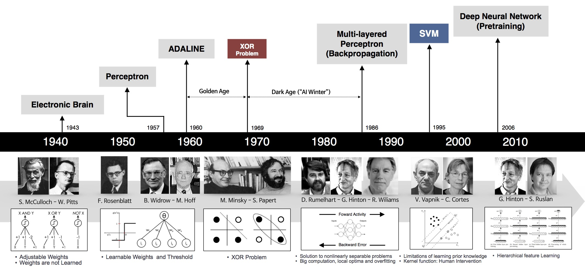

# REDES NEURAIS ARTIFICIAIS

Neste capítulo serão abordados os conceitos gerais das Redes Neurais Artificiais e, especificamente, das Redes Neurais Convolucionais.

## 1 CONCEITOS GERAIS

Segundo \citeonline[p. 3]{rezende2003sistemas}, o objetivo das pesquisas em IA é capacitar o computador a executar funções que são desempenhadas pelo ser humano usando conhecimento e raciocínio. Para que se possa aspirar à ação inteligente, deve-se analisar todos os aspectos relativos ao desenvolvimento e uso da inteligência.

Assim, a área das Redes Neurais Artificiais, também conhecida como neurocomputação, redes conexionistas, processadores paralelamente distribuídos, como abordado no trabalho de \apudonline[p. 142]{rezende2003sistemas}{braga2000redes}, é o campo que pesquisa modelos matemáticos baseados no funcionamento do cérebro humano.

No entanto, como abordado por \citeonline[p. 21]{kovacs2006redes}, é importante esclarecer que, apesar do conhecimento científico sobre o funcionamento do sistema nervoso humano ter crescido bastante nos últimos tempos, este ainda é muito incompleto.

Dessa forma, o que se conhece até o momento são apenas generalizações de observações isoladas realizadas em sistemas com condições controladas. Apesar disso, a estrutura fisiológica básica do cérebro é conhecida, e é exatamente nesta estrutura fisiológica que se baseiam as RNAs.

Assim, de acordo com \citeonline[p. 27]{haykin2007redes}, a pesquisa em redes neurais tem sido motivada desde o início pela concepção de que o cérebro humano processa informações de uma maneira bastante diferente do computador digital tradicional.

Sendo assim, o cérebro é um sistema de processamento de informação altamente complexo, não linear e paralelo. Ele pode organizar seus elementos, os neurônios, de forma a realizar certos processamentos muito mais rapidamente que o computador mais veloz hoje existente.

Um cérebro em "desenvolvimento" é sinônimo de um cérebro plástico: a plasticidade permite que o sistema nervoso em desenvolvimento se adapte ao seu meio ambiente, como descrito por \citeonline[p. 27]{haykin2007redes}.

Dessa forma, de acordo com \apudonline[p. 28]{haykin2007redes}{aleksander1990introduction}, uma rede neural pode ser vista como uma máquina adaptativa, ou seja, um processador maciçamente paralelo e distribuído, constituído de unidades de processamento simples, que têm propensão natural para armazenar conhecimento experimental e torná-lo disponível para o uso.

Por fim, as rede artificiais são normalmente implementadas com componentes eletrônicos ou é simulada por programação em um computador digital, como abordado por \citeonline[p. 28]{haykin2007redes}.

## 2 O CÉREBRO HUMANO

De acordo com \citeonline[p. 32]{haykin2007redes}, o sistema nervoso humano pode ser visto como um sistema de três estágios, como mostrado na Figura \ref{fig03}.

{#fig03 width=60%}

Fonte: \apudonline[p. 32]{haykin2007redes}{arbib1987brains}

O centro do sistema é o cérebro, representado pela rede neural (nervosa), que recebe continuamente informação, percebe esta e toma decisões apropriadas. Dois conjuntos de setas são mostrados, aquelas que apontam da esquerda para a direita indicam a transição para frente do sinal portador de informação, através do sistema.

As setas apontando da direita para a esquerda representam a presença de realimentação do sistema. Os receptores convertem estímulos do corpo humano ou do ambiente externo em impulsos elétricos que transmitem informação para a rede neural (cérebro). Já os atuadores convertem impulsos elétricos gerados pela rede neural em respostas discerníveis como saídas do sistema.

Por conseguinte, verifica-se que os neurônios são de cinco a seis ordens de grandeza mais lentos que as portas lógicas de silício. Os eventos em um circuito de silício acontecem em nanossegundos ($\[10^{-9}\]$s), enquanto eventos neurais ocorrem em milissegundos ($\[10^{-3}\]$s).

Entretanto, o cérebro compensa a taxa de operação relativamente lenta de um neurônio pelo número realmente espantoso de neurônios (células nervosas), com conexões maciças entre si. \cite[p. 32]{haykin2007redes}

Assim, como verificado no trabalho de \citeonline[p. 30-31]{silva2010redes}, estima-se que a rede neural em um humano adulto seja composta por cerca de 100 bilhões ($\[10^{11}\]$) de neurônios. Cada neurônio está interligado por conexões sinápticas em média a outros 6000 neurônios, perfazendo um total de 600 trilhões de sinapses.

De acordo com \apudonline[p. 32]{haykin2007redes}{faggin1991vlsi}, esta organização neural resulta em uma estrutura extremamente eficiente.

Mais especificamente, a eficiência energética do cérebro é de aproximadamente $\[10^{-16}\]$ joules por operação por segundo, enquanto o valor correspondente para os melhores computadores atuais é de cerca de ($\[10^{-6}\]$s) joules por operação por segundo.

Nas décadas de 1950 e 1960, como resultado do trabalho de vários pesquisadores, passou-se a entender o neurônio biológico como sendo basicamente o dispositivo computacional elementar do sistema nervoso, que possuía muitas entradas e uma saída, como abordado no trabalho de \citeonline[p. 15]{kovacs2006redes}. Este é um dos principais conceitos das redes neurais biológicas utilizado nas redes neurais artificiais.

Assim, ainda segundo \citeonline[p. 13]{kovacs2006redes}, a célula nervosa, ou neurônio, foi identificada anatomicamente e descrita com notável detalhe pelo neurologista espanhol \citeonline{ramonycajal1906histologie}.

O neurônio possui cerca de 100 $\[\mu\]$m, e é composto basicamente pelo corpo da célula, ou soma, de onde projetam-se extensões filamentares, os dendritos e o axônio, como pode ser visto na Figura \ref{fig04}.

{#fig04 width=90%}

Fonte: Adaptado de \citeonline{nutricao2016sistema}

De acordo com \citeonline[p. 13]{kovacs2006redes}, os dendritos cobrem um volume muitas vezes maior do que o próprio corpo celular e formam uma árvore dendrital. O axônio, também referido como fibra nervosa, serve para conectar a célula nervosa a outras do sistema nervoso.

Segundo \citeonline[p. 6-7]{braga2000redes}, os dendritos têm por função receber os impulsos nervosos, oriundos de outros neurônios e conduzidos até o corpo celular, onde a informação é processada e novos impulsos são gerados.

Estes impulsos são transmitidos a outros neurônios, passando através do axônio até os dendritos dos neurônios seguintes.

O neurônio possui geralmente um único axônio, embora esse possa apresentar algumas ramificações. Em alguns casos estende-se por vários metros. Alguns tipos de neurônios – a grande maioria dos que constituem o sistema nervoso central dos vertebrados – possui uma capa segmentada de mielina, que serve para acelerar a transmissão da informação pelo axônio.

De acordo com \citeonline[p. 13]{kovacs2006redes}, as entradas dos neurônios ocorrem através das conexões sinápticas, que conectam a árvore dendrital aos axônios de outras células nervosas.

Os sinais que chegam por estes axônios são pulsos elétricos conhecidos como impulsos nervosos ou potenciais de ação, e constituem a informação que o neurônio processará, de alguma forma, para produzir como saída um impulso nervoso no seu axônio. A direção do fluxo dos pulsos elétricos no neurônio pode ser visto na Figura \ref{fig05}.

{#fig05 width=70%}

Fonte: \citeonline{aprendis2016redes}

Pode-se dizer que as sinapses são regiões eletroquimicamente ativas compreendidas entre duas membranas celulares dos neurônios, a pré-sináptica, por onde chega um estímulo proveniente de uma outra célula, e a pós-sináptica, que é a do dendrito.

Nesta região intersináptica, o estímulo nervoso que chega a sinapse é transferido à membrana dendrital através de substâncias conhecidas como neurotransmissores. O resultado dessa transferência é uma alteração no potencial elétrico da membrana pós-sináptica. \cite[p. 13]{kovacs2006redes}

Segundo \citeonline[p. 7]{braga2000redes}, o tipo de neurotransmissor (há em torno de 100 diferentes tipos de neurotransmissores) liberado determinará a polarização ou a despolarização do corpo do neurônio seguinte.

Assim, de acordo com o neurotransmissor liberado, a sinapse poderá ser inibitória ou excitatória. A contribuição de todos os nós pré-sinápticos na polarização do neurônio pós-sináptico determinará se este irá ou não gerar um impulso nervoso.

Portanto, o percentual de disparo de um neurônio é determinado pelo acúmulo de um número grande de entradas inibitórias e excitatórias, medido pelo corpo da célula em um pequeno intervalo de tempo.

Depois de gerar um impulso, o neurônio entra em um período de refração (período em que o axônio não pode ser novamente estimulado), durante o qual retorna ao seu potencial de repouso enquanto se prepara para a geração de um novo impulso.

Há uma diferença de potencial (em volts) entre o interior e o exterior do neurônio, ocasionada pela diferença entre a concentração de potássio dentro da célula que cria um potencial elétrico de -70 mV (potencial de repouso) em relação ao exterior.

Por fim, para que a célula dispare, produzindo um potencial de ação (impulso nervoso), é preciso que os impulsos das sinapses reduzam este nível para cerca de -50 mV. \cite[p. 7]{braga2000redes}

## 3 NEURÔNIOS ARTIFICIAIS

Segundo \citeonline[p. 33]{silva2010redes}, o modelo de neurônio de \citeonline{mcculloch1943logical}, o MCP, ainda é o modelo mais utilizado nas diferentes arquiteturas de RNAs. Uma representação do modelo MCP pode ser vista na Figura \ref{fig06}.

{#fig06 width=80%}

Fonte: Adaptado de \citeonline[p. 36]{haykin2007redes}

De acordo com \citeonline[p. 34]{silva2010redes} e \citeonline[p. 8-9]{braga2000redes}, o neurônio artificial do modelo MCP possui os seguintes elementos:

1. Terminais de entrada $\[x_{1},x_{2},...,x_{n}\]$, que representam os dendritos.
2. Pesos $\[w_{1},w_{2},... ,w_{n}\]$ associados aos terminais de entrada que emulam o comportamento das sinapses. Os valores podem ser positivos ou negativos, dependendo se as sinapses forem inibitórias ou excitatórias.
3. Combinador linear $\[\Sigma\]$, que emula o corpo do neurônio biológico, cuja função é realizar a soma dos valores $\[x_{i}w_{i}\]$ recebidos pelo neurônio (soma ponderada) e decidir se o neurônio deve ou não disparar (saída igual a _1_ ou a _0_), comparando a soma obtida ao limiar de ativação do neurônio.
4. Limiar de ativação $\[\theta\]$ (ou bias ou _threshold_), que é a variável que especifica qual será o patamar apropriado para que o resultado produzido pelo combinador linear possa gerar um valor de disparo em direção à saída do neurônio.
5. Potencial de ativação $\[u\]$, que é o resultado produzido pela diferença do valor produzido entre o Combinador linear e o limiar de ativação. Se $\[u >= \theta\]$, então o neurônio produz um potencial excitatório; caso contrário, o potencial será inibitório.
6. Função de ativação $\[g(.)\]$, que ativa ou não a saída, dependendo do valor da soma ponderada das suas entradas;
7. Sinal de saída $\[y\]$ que representa axônio, que consiste do valor final produzido pelo neurônio em relação a um determinado conjunto de sinais de entrada, podendo ser também utilizado por outros neurônios que estão sequencialmente interligados.

Duas expressões que podem sintetizar o resultado do neurônio MCP são dadas nas Equações (3.1) e (3.2)

\begin{equation}
u = \sum_{i=1}^{n}(x_{i}w_{i}) - \theta
\end{equation}

\begin{equation}
y = g(u)
\end{equation}

Já Equação (3.1,) $\[n\]$ é o número de entradas do neurônio, $\[w_{i}\]$ é o peso associado à entrada $\[x_{i}\]$, $\[\theta\]$ é o limiar de ativação e $\[y\]$ é a saída. Já na Equação (3.2), $\[g(u)\]$ é a função de ativação aplicada ao potencial de ativação do neurônio.

Dessa forma, um neurônio MCP terá sua saída $\[y\]$ ativada quando $\[u >= \theta\]$, ou seja, quando $\[\sum_{i=1}^{n}(x_{i}w_{i}) >= \theta\]$.

## 4 FUNÇÕES DE ATIVAÇÃO

A partir do modelo proposto por McCulloch e Pitts, foram derivados vários outros modelos que permitem a produção de uma saída qualquer, não necessariamente zero ou um, e com diferentes funções de ativação. \cite[p. 10]{braga2000redes}

Algumas funções de ativação bastante utilizadas, como verificado nos trabalhos de \citeonline[p. 10-11]{braga2000redes}, \citeonline{silva2010redes}, \citeonline[p. 21-23]{kovacs2006redes} e \citeonline[p. 38-40]{haykin2007redes} são listadas nas Equações de (3.3) a (3.7) a seguir. Os gráficos das funções podem ser vistos na Figura \ref{fig07}, também a seguir.

{#fig07 width=90%}

Fonte: Adaptado de \citeonline[p. 36-42]{silva2010redes}

a) Função linear, dada pela Equação (3.3):
\begin{equation}
g(u) = \alpha u
\end{equation}

Nesta função, $\[\alpha\]$ é um número real que define a saída linear para os valores de entrada, $\[g(u)\]$ é a saída e $\[u\]$ é a entrada. O gráfico da função pode ser visto na Figura \ref{fig07} (a).

b) Função degrau, limiar, _heavyside_ ou _hard limiter_, dada pela Equação (3.4):
\begin{equation}
\[g(u) = \left\{ \begin{array}{rll} 1, & \hbox{se} & u >= 0 \\ 0, & \hbox{se} & u=0 \end{array}\right.\]
\end{equation}

O resultado produzido pela aplicação da função degrau assumirá valores unitários positivos quando o potencial de ativação do neurônio for maior ou igual a zero; caso contrário, assumirá valores nulos. O gráfico da função pode ser visto na Figura \ref{fig07} (b).

c) Função degrau bipolar, (ou sinal, _symmetric hard limiter_, linear por partes ou rampa), dada pela Equação (3.5):
\begin{equation}
\[g(u) = \left\{ \begin{array}{rll} 1, & \hbox{se} & u>0 \\ 0, & \hbox{se} & u=0 \\ -1, & \hbox{se} & u<0 \end{array}\right.\]
\end{equation}

O resultado produzido pela aplicação desta função de ativação assumirá valores unitários positivos quando o potencial de ativação do neurônio for maior que zero; valor nulo quando o potencial for também nulo; e valores negativos quando o potencial for menor que zero. O gráfico da função pode ser visto na Figura \ref{fig07} (c).

d) Função tangente hiperbólica, dada pela Equação (3.6):
\begin{equation}
\[g(u)=\frac{1-e^{-\beta u}}{1+e^{-\beta u}}\]
\end{equation}

O resultado de saída sempre assumirá valores reais entre $\[-1\]$ e $\[1\]$, onde $\[\beta\]$ está também associado ao nível de inclinação da função tangente hiperbólica em relação ao seu ponto de inflexão. O gráfico da função pode ser visto na Figura \ref{fig07} (d).

e) Função sigmoidal, logística ou _S-shape_, dada pela Equação (3.7):
\begin{equation}
\frac{1}{1+e^{-\beta u}}
\end{equation}

Na função, $\[\beta\]$ é uma constante real associada ao nível de inclinação da função logística frente ao seu ponto de inflexão. O resultado de saída da função logística assumirá sempre valores reais entre $\[0\]$ e $\[1\]$. O gráfico da função pode ser visto na Figura \ref{fig07} (e).

## 5 ARQUITETURAS DE REDE

De acordo com \citeonline[p. 11-12]{braga2000redes} e \citeonline[p. 46]{haykin2007redes}, a arquitetura de uma RNA está intimamente ligada com o algoritmo de aprendizagem utilizado para treinar a rede e esta define os tipos de problema que a rede pode tratar.

Redes com uma única camada de nós MCP, por exemplo, só conseguem resolver problemas linearmente separáveis [^Problemas linearmente separáveis]. Redes recorrentes, por sua vez, são mais apropriadas para resolver problemas que envolvem processamento temporal.

[^Problemas linearmente separáveis]: Problemas onde as classes representadas em um hiperplano podem ser separadas por uma reta. Na Figura \ref{fig08}, em (a) é possível verificar uma função linearmente separável e em (b) uma não linearmente separável.

{#fig08 width=90%}

Fonte: \citeonline[p. 62]{silva2010redes}

A arquitetura das RNA possui os seguintes parâmetros: número de camadas de rede, número de nós por camada, tipo de conexão entre os nós e a topologia da rede.

Conforme \citeonline[p. 45]{silva2010redes}, o treinamento de uma arquitetura específica consiste da aplicação de um conjunto de passos ordenados com o intuito de ajustar os pesos e os limiares de seus neurônios.

Assim, tal processo de ajuste, também conhecido como algoritmos de aprendizagem, visa então sintonizar a rede para que as suas respostas estejam próximas dos valores desejados.

Ainda de acordo com \citeonline[p. 46]{silva2010redes}, uma RNA pode ser dividida em três partes, denominadas camadas, as quais são nomeadas da seguinte forma:

- Camada de entrada: É a camada responsável pelo recebimento de dados do meio externo.
- Camadas escondidas, intermediárias, ocultas ou invisíveis: São aquelas compostas de neurônios que extraem as características associadas ao processo ou sistema a ser inferido. Quase todo o processamento interno da rede é realizado nessas camadas.
- Camada de saída: Esta camada também é composta por neurônios, onde são produzidos os resultados finais da rede.

Também é possível classificar as redes neurais quanto à sua conectividade. Quando todos os nós de uma camada estão conectados, esta rede é chamada de completamente conectada, e quando não estão, é chamada de parcialmente conectada.

Há representações de redes completamente conectadas nas Figuras \ref{fig09}, \ref{fig10} e \ref{fig11} e de uma rede parcialmente conectada na Figura \ref{fig12}.

De acordo com \citeonline[p. 46-49]{haykin2007redes}, existem basicamente três classes de arquiteturas de redes: as alimentadas adiante com camada única, as alimentadas diretamente com múltiplas camadas e as recorrentes. Tais classes serão melhor descritas a seguir.

### Redes alimentadas adiante com camada única

Segundo \citeonline[p. 46-47]{haykin2007redes} e \citeonline[46-47]{silva2010redes}, nesta configuração, também chamada de _feedforward_ ou acíclica, há apenas uma camada de neurônios, que é tanto a de entrada quanto a de saída, estritamente do tipo alimentada adiante. São tipicamente utilizadas em problemas envolvendo classificação de padrões e filtragem linear.

Ainda de acordo com \citeonline[p. 46-47]{silva2010redes}, os principais tipos de redes _feedforward_ com camada única são o _Perceptron_ e o _Adaline_, cujos algoritmos de aprendizado utilizados para o trenamento são respectivamente baseados na regra de Hebb e na regra Delta. Uma rede _feedforward_ de camada única é representada na Figura \ref{fig09}.

{#fig09 width=70%}

Fonte: \citeonline[p. 47]{haykin2007redes}

### Redes alimentadas diretamente com múltiplas camadas

Segundo \citeonline[p. 47]{haykin2007redes} e \citeonline[p. 47-48]{silva2010redes}, a classe chamada de _feedforward_ de múltiplas camadas distingue-se pela presença de uma ou mais camadas ocultas.

Os nós de entrada da rede fornecem a entrada aos neurônio da segunda camada, e assim por diante, até a camada de saída, que constitui a resposta global da rede.

Ainda de acordo \citeonline[p. 48]{silva2010redes}, os principais modelos de redes com este tipo de arquitetura são o _Perceptron_ multicamadas (_Multilayer Perceptron_ - MLP) e as redes de base radial (_Radial Basis Function_ - RBF), cujos algoritmos de aprendizado são, respectivamente, os baseados na regra delta generalizada e na regra delta/competitiva.

Estas redes são empregadas na solução de diversos tipos de problemas, tais como aqueles relacionados à aproximação de funções, classificação de padrões, identificação de sistemas, otimização, etc. \cite[p. 47]{silva2010redes}. Uma representação deste tipo de rede é demonstrada na Figura \ref{fig10}.

{#fig10 width=70%}

Fonte: \citeonline[p. 48]{haykin2007redes}

### Redes recorrentes

De acordo com \citeonline[p. 47]{haykin2007redes} e \citeonline[p. 49]{silva2010redes}, nas redes dessa classe, também chamada de realimentada, com ciclos ou _feedback_, as saídas dos neurônios servem como sinais de entrada de outros neurônios.

Uma rede recorrente pode constituir, por exemplo, de uma única camada de neurônios com cada neurônio alimentando seu sinal de saída de volta para as entradas de outros neurônios.

A característica de realimentação qualifica tais redes para processamento dinâmico de informações, como previsão de séries temporais, otimização e identificação de sistemas, etc. \cite[p. 49]{silva2010redes}

Os principais tipos redes dessa classe são a de Hopfield e a _Perceptron_ multicamadas com realimentação em camadas distintas, cujos algoritmos de aprendizado são, respectivamente, baseados na minimização de funções de energia e na regra delta generalizada.

Na Figura \ref{fig11} está representada uma rede _Perceptron_ com realimentação, com dois sinais da camada de saída retroalimentando a camada intermediária. Na Figura \ref{fig12} há outro exemplo de rede recorrente.

{#fig11 width=70%}

Fonte: \citeonline[p. 49]{silva2010redes}

{#fig12 width=70%}

Fonte: \citeonline[p. 12]{braga2000redes}

## 6 APRENDIZADO E TREINAMENTO

De acordo com \citeonline[p. 35]{braga2000redes}, com o trabalho de \citeonline{rosenblatt1958perceptron}, o conceito de aprendizado em RNAs foi introduzido. O modelo proposto, conhecido como Perceptron, era composto por uma estrutura de rede que utilizada os nós básicos MCP e uma regra de aprendizado.

Posteriormente, Rosenblatt demonstrou o teorema de convergência do Perceptron, que mostra que um nó MCP treinado com o algoritmo de aprendizado do Perceptron sempre converge caso o problema em questão seja linearmente separá

Apesar das várias possíveis interpretações da expressão "aprendizagem", uma possível definição no contexto de redes neurais é a seguinte:

>Aprendizagem é o processo pelo qual os parâmetros de uma rede neural são ajustados através de uma forma continuada de estímulo pelo ambiente no qual a rede está operando, sendo o tipo específico de aprendizagem realizada definido pela maneira particular como ocorrem os ajustes realizados nos parâmetros. \apud[p. 15-16]{braga2000redes}{mendel1970adaptive}

De acordo com \citeonline[p. 75-76]{haykin2007redes}, uma RNA aprende sobre seu ambiente através de um processo interativo de ajustes de seus pesos sinápticos e níveis de bias.

Assim, um conjunto bem definido de regras para a solução de aprendizagem é chamado de algoritmo de aprendizagem, e a aplicação do algoritmo nos dados de entrada do domínio do problema é chamada de treinamento.

Existem diversos tipos de algoritmos, cada um com suas vantagens e desvantagens, onde o que os diferencia é basicamente a forma pela qual o ajuste dos pesos é feita. \cite[p. 15]{braga2000redes}

O procedimento de aprendizagem da rede é iterativo: modifica ligeiramente para cada ciclo de aprendizagem – denominado época – os pesos sinápticos usando um conjunto selecionado chamado conjunto de treinamento. Em cada ciclo, os pesos devem ser modificados para minimizar uma função de custo (ou erro), que é específica para o problema em questão. \cite[p. 90, tradução nossa]{zaccone2016getting}

As funções de custo mais comuns são a do erro quadrático e a cross-entropy, e os algoritmos para a minimização do erro mais comuns são os que são baseados no gradiente descendente.

Ao longo da aplicação do algoritmo de aprendizagem, a rede neural será capaz de extrair características do sistema por meio do conjunto de treinamento do problema.

Por fim, ainda de acordo com citeonline[p. 16]{braga2000redes}, é possível agrupar os algoritmos de aprendizado em dois grupos: aprendizado supervisionado e não supervisionado, que serão abordados nas seções seguintes.

### Aprendizado supervisionado

De acordo com \citeonline[p. 16]{braga2000redes}, este método de aprendizado é o mais comum no treinamento das RNAs, onde um supervisor (professor) fornece as entradas e a saída desejadas para a rede.

Segundo \citeonline[p. 88-89]{haykin2007redes} e \citeonline[p. 16]{braga2000redes}, o professor indica comportamentos bons e ruins para a rede para direcionar o treinamento.

A cada entrada compara-se a resposta desejada com a resposta real calculada, ajustando-se os pesos das conexões para minimizar o erro. Assim, o erro é justamente a diferença entre a resposta desejada e a resposta real da rede.

A soma dos erros quadráticos de todas as saídas é normalmente utilizada como medida de desempenho da rede e também como função de custo a ser minimizada pelo algoritmo de treinamento. \cite[p. 16]{braga2000redes}

Como visto ainda em \citeonline[p. 16]{braga2000redes}, a desvantagem do aprendizado supervisionado é que, na ausência de um professor, o aprendizado para situações não previstas no treinamento não é possível.

Por fim, verifica-se que os modelos de aprendizado supervisionado mais conhecidos são os baseados na regra delta e os de _backpropagation_. Na Figura \ref{fig13} há uma representação de um diagrama em blocos da aprendizagem supervisionada.

{#fig13 width=80%}

Fonte: \citeonline[p. 88]{haykin2007redes}

### Aprendizado não supervisionado

Neste processo de aprendizagem, como o próprio nome diz, não há um professor para supervisionar o processo de aprendizagem, logo, não existe um fornecimento de entradas e saída desejadas para a rede.

Ao invés disso, a própria rede deve se auto-organizar em relação às particularidades existentes enter os elementos componentes do conjunto total de amostras, identificando subconjuntos (_clusters_) que contenham similaridades.

Os pesos sinápticos e limiares dos neurônios da rede são então ajustados pelo algoritmo de aprendizagem de forma a refletir esta representação internamente dentro da própria rede. \cite[p. 56]{silva2010redes}

De acordo com \citeonline[p. 19]{braga2000redes}, a estrutura do sistema de aprendizado não supervisionado pode adquirir uma variedade de formas diferentes.

Ela pode, por exemplo, consistir em uma camada de entrada, uma camada de saída, conexões _feedforward_ da entrada para a saída e conexões laterais entre os neurônios da camada de saída.

Ainda segundo \citeonline[p. 19]{braga2000redes}, um outro exemplo uma rede _feedforward_ com múltiplas camadas, em que a livre organização procede na base de camada por camada.

Nestes dois exemplos, o processo de aprendizado consiste em modificar repetidamente o peso sináptico de todas as conexões em resposta às entradas.

Alguns possíveis modelos para aprendizado não supervisionado são o aprendizado hebbiano, a Regra de Oja, a Regra de Yuille e o aprendizado por competição. \braga20-24.

Na Figura \ref{fig14} há uma representação de um diagrama em blocos da aprendizagem não supervisionada.

{#fig14 width=75%}

Fonte: \citeonline[p. 91]{haykin2007redes}

## OUTRAS CONSIDERAÇÕES SOBRE APRENDIZADO

De acordo com (braga, p. 56-57) e (SILVA, p. 153-154) ao se utilizar uma quantidade excessiva de neurônios ocultos, ao invés de extrair características gerais que permitirão a generalização ou reconhecimento de padrões não vistos durante o treinamento, a rede pode memorizar os padrões de treinamento, o que é chamado de overfitting. Nessas ocorrências, o erro durante a fase de aprendizado tende a ser bem baixo; contudo, durante a fase de generalização frente aos subconjuntos de teste, o erro tende a assumir valores bem elevados, fato que denota a condição de overfitting.  (braga, p. 56-57) e (SILVA, p. 153-154)

Por outro lado, o uso de uma quantidade muito pequena de neurônios ocultos pode forçar a rede a gastar tempo em excesso tentando encontrar uma representação ótima ou não convergir, o que é chamado de underfitting. Nesses casos, por sua vez, o erro tanto na fase de aprendizado como na fase de teste serão bem significativos.

Por conseguinte, quando se está trabalhando com problemas do mundo real, surgem alguns problemas que geralmente não existem nos problemas artificiais, dentre eles destacam-se: a quantidade de amostras insuficiente, a existência de dados redundantes e a grande quantidade de ruído, inerente aos procedimentos de amostragem. (Leandro Nunes de Castro Silva, p. 114)

Assim, procedimentos de validação cruzada (CV - do inglês cross validadtion) podem ser usados para detectar overfitting e interromper o treinamento antes que isso ocorra. (Leandro Nunes de Castro Silva, p. 114)

Durante o treinamento de uma RNA, geralmente se deseja obter uma rede com a melhor capacidade de generalização possível, ou seja, a maior capacidade de responder corretamente a dados que não foram utilizados no treinamento, evitando por exemplo o overfitting.

A utilização de procedimentos de CV é geralmente feita da seguinte maneira:
- Dividir aleatoriamente o conjunto de dados em treinamento, validação e teste;
- Treinar somente com o conjunto de treinamento e avaliar o erro do conjunto de validação a cada k iterações (épocas)
- Interromper o treinamento quando o erro do conjunto de validação for maior do que era k iterações atrás
- Utilizar o conjunto de pesos anteriores como o resultado de treinamento

Esta abordagem utiliza o conjunto de validação para antecipar o comportamento em situações reais, assumindo que o erro em ambos os casos será semelhante: o erro de validação geralmente é uma estimativa do erro de generalização. O conjunto de testes, será utilizado para verificar se os aspectos referentes à generalizaçaõ de soluções estão em patamares aceitáveis. Já o conjunto de testes será utilizado para realizar propriamente o treinamento da rede, com a atualização dos pesos e bias.

Composto aleatoriamente com cerca de 60% a 90% das amostras do conjunto total é usado para o treinamento. \citeonline[50-51]{silva2010redes} Já o subconjunto de teste, composto por cerca de 10% a 40%. Assim, o dimensionamento desses conjuntos deve levar em consideração a caracterização estatística dos dados. \citeonline[50-51]{silva2010redes}

Já de acordo com (Leandro Nunes de Castro Silva, p. 119 apud Haykin), algumas abordagens sugerem que o conjunto seja dividido da seguinte forma: 50% dos dados para treinamento, 25% para validação e 25% para teste.

### MATRIZ DE CONFUSÃO

Uma matriz de confusão (ou matriz de erro) é uma forma de medir o desempenho de um algoritmo de aprendizado (geralmente supervisionado). Basicamente a matriz é uma representação bidimensional do cruzamento entre as informações das amostras reais e as classificações realizadas por um sistema de classificação. O nome decorre do fato de que é possível verificar se o modelo treinado está confundindo duas classes.

Assim, cada linha da matriz representa as amostras reais, enquanto cada coluna representa as classificações realizadas pelo sistema de classificação.

Os dados da matriz são extraídos das classificações realizadas com os conjuntos de validação ou de teste. Durante a construção da matriz, é possível encontrar várias métricas importantes para o campo da aprendizagem por máquinas. Na Tabela X pode ser conferida uma matriz de confusão para duas instâncias, a palavra "one" e a palavra "two".

Tabela

As entradas na matriz de confusão têm o seguinte significado:

a é o número de classificações corretas da instância "one" ,
b é o número de classificações incorretas da instância "two",
c é o número classificçaões incorretas da instância "one"
d é o número de classificações corretas da instância "two".

-A acurácia (AC) é a proporção do número total de previsões corretas. É determinado usando a equação: AC = (a+d) / (a+b+c+d)
-A taxa positiva verdadeira (TP) é a proporção de casos da classe "Two" que foram identificados corretamente, calculado usando a equação: TP = d/(c+d)
-A taxa de falso positivo (FP) é a proporção de casos "One" classificados incorretamente como "Two", calculados usando a equação: TN = a/(a+b)
-A taxa de falso negativo (FN) é a proporção de casos "Two" que foram classificados incorretamente como "One", calculado usando a equação: FN = c/(c+d)
-Finalmente, a precisão (P) é a proporção dos casos "Two" classificados corretamente, calculado usando a equação: P=d/(b+d)

Todos as classificações que estão na diagonal principal são acertos, e todas as classificações que não estão são erros, portanto, é fácil analisar a qualidade das previsões do modelo. Dessa forma, um modelo perfeito teria uma diagonal principal preenchida, e todos os outros valores zerados.

Uma outra matriz de confusão pode ser vista na Tabela Y com as classificações um modelo treinado para prever as palavras "zero", "one" e "two". Assumindo uma amostra de 27 palavras, sendo 8 "zero", 6 "one" e 13 "two", a matriz de confusão resultante poderia parecer com a tabela abaixo:

tabelaY

Na matriz, dos 8 "zero" reais, o sistema previu que 3 eram "one" e dos 6 "one", o sistema previu que 1 era "two" e 2 eram "zero". Quando  Desta forma é possível visualizar que o algoritmo em questão tem dificuldade para distinguir entre "one" e "zero", mas pode realizar a distinção entre "two" e outras palavras de forma conveniente.

zero, one, two
"gato", ""cães"" e ""two"s",

Na matriz, quando a palavra era "zero", o sistema previu que era "zero" 5 vezes, que era "one" 3 vezes e que era "two" 0 vezes. Quando a palavra era "two", o sistema previu que era "zero" 2 vezes, que era "two" 3 vezes e que era "two" 1 vez. Por fim, quando a palavra era "two", o sistema previu que era "zero" 0 vezes, que era "two" 2 vezes e que era "two" 11 vezes.

N é o número de amostras

https://en.wikipedia.org/wiki/Confusion_matrix

http://www2.cs.uregina.ca/~dbd/cs831/notes/confusion_matrix/confusion_matrix.html

http://www.revistabw.com.br/revistabw/matriz-de-confusao/

(TING, 2011, p. 209, tradução nossa)

TING, K. M. Confusion Matrix. In: SAMMUT, C.; WEBB, G. I. (Orgs.) **Encyclopedia of Machine Learning**. New York: Springer, 2011. ISBN 9780387303688. DOI 10.1007/978-0387-30164-8. Ed: 1.

RICHERT, W.; COELHO, L. P. Building Machine Learning Systems with Python. 1 ed. Birmingham: Packt Publishing. 2013. ISBN 9781782161400.

## 7 PERCEPTRON DE UMA CAMADA

As redes _Perceptron_ de camada única são caracterizadas pela presença de apenas uma camada neural, com apenas um neurônio nesta única camada, cujo treinamento acontece de forma supervisionada.

Rosenblatt demonstrou o teorema de convergência do _Perceptron_ de uma camada, que mostra que um nó MCP treinado com seu algoritmo de aprendizado sempre converge para uma resposta correta caso o problema em questão seja linearmente separável.

Conforme \citeonline[p. 60]{silva2010redes}, geralmente as funções de ativação utilizadas no _Perceptron_ de uma camada são a função degrau (que terá como saída 0 ou 1) e degrau bipolar (que terá como saída -1 ou 1).

Uma representação do _Perceptron_ de uma camada pode ser vista na Figura \ref{fig15}.

{#fig15 width=80%}

Fonte: \citeonline[p. 91]{haykin2007redes}

Ainda de acordo com \citeonline[p. 64]{silva2010redes}, o ajuste dos pesos e limiar do _Perceptron_ é realizado por meio da regra de aprendizado de \citeonline{hebb1949organization}, que podem ser expressas pela Equação (3.7):
\begin{equation}
w_{atual} = w_{anterior} + \eta (d^{(k)} - y)x^{(k)})
\end{equation}

Na equação, $\[w=[\theta,w_1,w_2,...,w_n]\]^{T}$ é o vetor contendo o limiar e os pesos, $\[x^{(k)}=[-1,x_{1}^{(k)},x_{2}^{(k)},...,x_{n}^{(k)}\]^{T}]\]$ é a k-ésima amostra de treinamento, $\[d^{(k)}\]$ é o valor desejado para a k-ésima amostra de treinamento, $\[y\]$ é o valor de saída produzida pelo _Perceptron_ e $\[\eta\]$ é uma constante que define a taxa de aprendizado da rede, que expressa o quão rápido o processo de treinamento da rede irá à convergência. Geralmente esta constante é um valor entre 0 e 1.

Assim, segundo \citeonline[p. 65-66]{silva2010redes} o algoritmo de treinamento do _Perceptron_ de camada única em pseudocódigo pode ser implementado conforme exposto no Algoritmo 1.

Algoritmo 1: Algoritmo de treinamento do _Perceptron_

(1) Obter o conjunto de amostras de treinamento $\[x^{(k)}\]$

(2) Associar a saída desejada $\[d^{(k)}\]$ para cada amostra obtida

(3) Iniciar o vetor $\[w\]$ com valores aleatórios pequenos

(4) Especificar a taxa de aprendizagem $\[\eta\]$

(5) Iniciar o contador de número de épocas: $\[{época} = 0\]$

(6) Repetir

(6.1) $\[{erro} = {"inexiste"}\]$

(6.2) Para todas as amostras de treinamento $\[\{x^{(k)},d^{(k)}\}\]$, fazer:

(6.2.1) $\[u = w^{T}x^{(k)}\]$

(6.2.2) $\[y = g(u)\]$

(6.2.3) Se $\[y \neq d^{(k)}\]$ então:

(6.2.3.1) $\[w = w_ + \eta (d^{(k)} - y)x^{(k)}\]$

(6.2.3.2) $\[{erro} = {"existe"}\]$

(6.3) $\[{época} = {época} + 1\]$

Até que: $\[{erro} = {"inexiste"}\]$

Uma vez que esteja treinada, a rede estará apta para classificar padrões (lineares) diante de novas amostras. Assim, após o treinamento, para utilizar o _Perceptron_ treinado é utilizado o algoritmo de operação (em pseudocódigo), apresentado no Algoritmo 2.

Algoritmo 2: Algoritmo de operação do _Perceptron_

(1) Obter uma amostra a ser classificada $\[{x}\]$

(2) Utilizar o vetor $\[w\]$ ajustado durante o treinamento

(3) Fazer:

(3.1) $\[u=w^{T}x\]$

(3.2) $\[y=g(u)\]$, onde $\[g(u)\]$ é geralmente a função degrau ou degrau bipolar

(3.3) Se $\[y=-1\]$ então:

(3.3.1) Amostra $\[x \in \{Classe \ A\}\]$

(3.4) Se $\[y=1\]$ então:

(3.4.1) Amostra $\[x \in \{Classe \ B\}\]$

Por fim, como retratado por \citeonline[p. 66]{silva2010redes} é possível abstrair o processo de treinamento do _Perceptron_ de camada única como o processo de mover continuamente uma linha de classificação até que seja alcançada uma fronteira de separação que permite dividir as classes.

Como exemplo, é possível verificar na Figura \ref{fig16} uma ilustração do processo de trenamento do _Perceptron_ simples visando o alcance de uma fronteira de separabilidade para uma rede com duas entradas $\[\{x_1, x_2\}\]$. Ainda na imagem, tem-se que (1), (2), (3), (...) são as épocas de treinamento.

{#fig16 width=70%}

Fonte: \citeonline[p. 67]{silva2010redes}

## 8 PERCEPTRON DE MÚLTIPLAS CAMADAS

Nesta seção serão apresentados os conceitos gerais das redes _Perceptron_ de múltiplas camadas, além do algoritmo de aprendizagem _backpropagation_.

### Conceitos gerais

As redes _Perceptron_ de múltiplas camadas, ou MLP (_Multilayer Perceptron_) são redes completamente conectadas, caracterizadas por uma camada de entrada e uma ou mais camadas intermediárias (ocultas) de neurônios.

Cada neurônio possui uma função de ativação não linear (mas diferenciável em qualquer ponto), onde um tipo comum é a sigmóide. Uma representação de uma MLP Pode ser vista na Figura \ref{fig17}.

{#fig17 width=90%}

Fonte: \citeonline[p. 186]{haykin2007redes}

A utilização de uma camada intermediária é suficiente para aproximar qualquer função contínua, e duas camadas intermediárias são suficientes para aproximar qualquer função matemática. \cite[p. 55]{braga2000redes}

O treinamento acontece de forma supervisionada pelo algoritmo de retropropagação de erro (_error back-propagation_), também conhecido como regra _Delta_ generalizada.

De acordo com \citeonline[p. 183]{haykin2007redes}, a aprendizagem por retropropagação de erro consiste de dois passos através das diferentes camadas da rede: um passo para frente, a propagação, e um passo para trás, a retropropagação.

No passo para frente, um vetor de entrada é aplicado aos nós sensoriais da rede e seu efeito se propaga através da rede, camada por camada, onde os pesos sinápticos são fixos, até a produção da saída.

Ainda segundo \citeonline[p. 183]{haykin2007redes}, durante o passo para trás, os pesos sináptico são ajustados de acordo com uma regra de correção de erro. Basicamente, a resposta real é subtraída de uma resposta desejada para produzir um sinal de erro, que é propagado para trás através da rede, no sentido contrário das conexões sinápticas. Os pesos sinápticos são ajustados para fazer com que resposta real da rede se aproxime da resposta desejada.

### Algoritmo _backpropagation_

Inicialmente, é importante definir algumas variáveis e parâmetros para auxiliar no desenvolvimento do algoritmo _backpropagation_. É possível tomar então as seguintes variáveis, como abordado por \citeonline[p. 95-97]{silva2010redes}.

- $\[W_{ji}^{(L)}\]$ são matrizes de pesos cujos elementos denotam o valor do peso sináptico conectando o j-ésimo neurônio da camada $\[L\]$ ao i-ésimo neurônio da camada $\[(L-1)\]$.
- $\[I_{ji}^{(L)}\]$ são vetores cujos elementos são a entrada ponderada em relação ao j-ésimo neurônio da camada $\[L\]$.
- $\[n\]$ é a quantidade de camadas da rede.
- $\[n_{L}\]$ é a quantidade de neurônios por camada $\[L\]$.

Na Equação (3.8) a seguir há a definição do elemento $\[I_{ji}^{(L)}\]$.
\begin{equation}
I_{j}^{(L)} = \sum_{i=0}^{n_L}W_{ji}^{(L)}x_{i} \Leftrightarrow I_{j}^{(L)}=W_{j}_{0}^{(L)}x_{0}+W_{j1}^{(L)}x_{1}+...+W_{jn_{L}}^{(L)}x_{n_{L}}
\end{equation}

- $\[Y_{j}^{(L)}\]$ são vetores cujos elementos representam a saída do j-ésimo neurônio em relação à camada $\[L\]$. O elemento é definido na Equação (3.9)
\begin{equation}
Y_{j}^{(L)}=g(I_{j}^{(L)})
\end{equation}

Existem vários tipos de funções de erro, dentre elas, assim função de erro quadrático, que mostra o desvio entre as respostas produzidas pelos neurônios de saída da rede em relação aos respectivos valores desejados, como abordado no trabalho de \citeonline[p. 99]{silva2010redes} é definida pela Equação (3.10):
\begin{equation}
E(k) = \frac{1}{2}\sum_{j=1}^{n_L}[d_{j}(k)-Y_{j}^{(L)}(k)]^{2}
\end{equation}

Na equação (3.10), $\[n_{L}\]$ é a quantidade de neurônios na camada oculta $\[L\]$, $\[Y_{j}^{(L)}(k)\]$ é o valor produzido pelo j-ésimo neurônio de saída da rede considerando-se a k-ésima amostra de treinamento e $\[d_{j}(k)\]$ é o respectivo valor desejado.

Assim, assumindo um conjunto de treinamento composto por $\[\p\]$ amostras, a medição da evolução do desempenho global do algoritmo _backpropagation_ pode ser efetuada por meio da avaliação do erro quadrático médio, definido pela Equação (3.11):
\begin{equation}
E_{M} = \frac{1}{p}\sum_{k=1}^{p}E(k)
\end{equation}

Na Equação (3.11), $\[E(k)\]$ é o erro quadrático obtido na Equação (3.10).

Ainda de acordo com \citeonline[p. 100-108]{silva2010redes}, a equação do gradiente local $\[\delta_j^{L}\]$ em relação ao j-ésimo neurônio da camada de saída, que mede o erro do neurônio $\[j\]$ da camada $\[L\]$, é dada pela Equação (3.12):
\begin{equation}
\delta_{j}^{(L)} = \sum_{k=1}^{n_{L+1}}\delta_{k}^{(L+1)}W_{kj}^{(L+1)}{g}'(I_{j}^{(L)})
\end{equation}

O ajuste da matriz de pesos $\[W_{ji}^{(L)}\]$ pode ser escrito pela Equação (3.13):
\begin{equation}
W_{ji}^{(L)}(t+1)=W_{ji}^{(L)}(t)+\eta \delta_{j}^{(L)}Y_{i}^{L-1}
\end{equation}

Na Equação (3.13), $\[\eta\]$ é a taxa de aprendizagem do algoritmo _backpropagation._ Em notação algorítmica, o resultado da Equação (3.13) pode ser descrito pelo Algoritmo 3:

Algoritmo 3: Ajuste da matriz de pesos $\[W_{ji}^{(L)}\]$

$\(1) \ W_{ji}^{(L)}=W_{ji}^{(L)}+\eta \delta_{j}^{(L)}Y_{i}^{(L-1)}\]$

Por conseguinte, como descrito por \citeonline[p. 109-110]{silva2010redes}, o critério de parada do processo do algoritmo _backpropagation_ fica estipulado em função do erro quadrático médio calculado na Equação (3.10), levando em consideração as amostras de treinamento utilizadas.

Assim, o algoritmo converge quando o erro quadrático médio entre duas épocas sucessivas for sucessivamente pequeno, o que pode ser descrito na Equação (3.14):
\begin{equation}
\left | E_{M}^{atual} - E_{M}^{anterior} \right | <=  \varepsilon
\end{equation}

Na Equação (3.14), $\[\varepsilon\]$ é a precisão requerida para o processo de convergência.

Por fim, o treinamento do MLP com algoritmo _backpropagation_, como verificado em \citeonline[p. 110]{silva2010redes} em pseudocódigo pode ser representado pelo Algoritmo 4:

Algoritmo 4: Algoritmo de treinamento do MLP

(1) Fazer:

(1.1) $\[r = {quantidade \ de \ camadas \ ocultas \ da \ rede\]$

(1.2) $\[v = {quantidade \ de \ épocas\]$

(2) Obter o conjunto de amostras de treinamento $\[\{x^{(k)}\}\]$

(3) Associar o vetor de saída desejada $\[\{d^{(k)}\}\]$ para cada amostra

(4) Iniciar $\[\{W_{ji}^{(1)},{W_{ji}^{(2)},...,{W_{ji}^{(n_L)}\}\]$ com valores aleatórios pequenos

(5) Especificar a taxa de aprendizagem $\[\{\eta\}\]$ e a precisão requerida $\[\{\varepsilon\}\]$

(6) Iniciar o contador de número de épocas $\[\{{epoca} = 0\}\]$

(7) Repetir:

(7.1) $\[E_{M}^{anterior} = E_{M}\]$, conforme Equação (3.11) # Passo Forward

(7.2) Para $\[L\]$ de $\[1\]$ até $\[R\]$, fazer: # Passo Backward

(7.2.1) Obter $\[I_{j}^{L}\]$, conforme Equação (3.8)

(7.2.2) Obter $\[Y_{j}^{L}\]$, conforme Equação (3.9),

(7.2.3) Determinar $\[\delta_{k}^{L}\]$, conforme Equação (3.12)

(7.2.4) Ajustar W_{ji}^{L}, conforme Equação (3.13)

(7.3) $\[E_{M}^{atual} = E_{M}\]$, conforme Equação (3.14)

(7.4) $\[{epoca} = {epoca} + 1\]$

Até que: $\[\left | E_{M}^{atual} - E_{M}^{anterior} \right | <= \varepsilon \ E \ {epoca} <= v\]$

Por fim, após o treinamento do MLP, para utilizar o modelo treinado, como demonstrado em \citeonline[p. 111]{silva2010redes} é possível definir o seguinte algoritmo de operação:

Algoritmo 5: Algoritmo de operação do MLP

(1) $\[r = {quantidade \ de \ camadas \ ocultas \ da \ rede}\]$

(2) Obter uma amostra $\[x\]$

(3) Assumir $\[\{W_{ji}^{(1)},{W_{ji}^{(2)},...,{W_{ji}^{(n_L)}\}\]$ já ajustadas no treinamento

(4) Para $\[L\]$ de $\[1\]$ até $\[r\]$:

(4.1) Obter $\[I_{j}^{L}\]$, conforme a Equação (3.8)

(4.2) Obter $\[Y_{j}^{L}\]$, conforme a Equação (3.9),

(5) Disponibilizar as saídas da rede, dadas pelos elementos contidos em $\[Y_{j}^{r}\]$

## 9 REDES NEURAIS CONVOLUCIONAIS

Nesta seção serão abordados os conceitos gerais das Redes Neurais Convolucionais e as especificidades da RNA utilizada no trabalho, que é da arquitetura convolucional.

### Introdução

Existem diversos tipos de RNAs utilizadas para a construção de modelos de reconhecimento de fala, dentre eles _Sequence-to-sequence_, Recorrentes, _Long Short-term Memory_ (LSTM) e Convolucionais.

Como abordado anteriormente, o tipo de RNA utilizado no trabalho para o modelo de reconhecimento de fala foi uma Rede Neural Convolucional (RNC). No entanto, o tipo de RNA realmente utilizado é uma RNC modificada, que foi apresentada no trabalho de \citeonline{sainath2015convolutional}.

Este modelo de RNC foi implementada (em Python com o _TensorFlow_) no repositório no GitHub da ferramenta, \citeonline{google2017github} e a implementação é explicada no _site_ da própria ferramenta, \citeonline{google2017tutorial}.

No código da implementação existem quatro modelos de RNA disponíveis para utilização:

- _Single hidden fully-connected layer_: Um modelo com uma única camada escondida totalmente conectada, com resultados não muito precisos, mas com treinamento muito rápido e simples.
- _cnn-trad-fpool3_: É um modelo convolucional padrão, com boa precisão, mas que consome um volume razoável de processamento.
- _cnn-one-fstride4_: Modelo convolucional com baixos requisitos de computação.
- _Low latency SVDF Model_: Modelo com baixos requisitos de computação, mas também com menor precisão.

Assim, o modelo utilizado foi o _cnn-trad-fpool3_. Dessa forma, nas duas subseções a seguir serão contextualizadas as CNNs  e a CNN _cnn-trad-fpool3_.

Por fim, é importante ressaltar que os exemplos utilizados nas seções seguintes para a explicação das CNNs serão relacionados a problemas de classificação de imagens. No entanto, como um som pode ser representado como um espectrograma bidimensional, ou seja, uma imagem bidimensional, é possível fazer uma analogia com problemas de classificação de imagens.

Inclusive, como será explicado nas seções seguintes, o modelo de CNN utilizado, o _cnn-trad-fpool3_, utiliza exatamente esta abordagem, ou seja, representa os arquivos de som como espectrogramas bidimensionais.

### Conceitos gerais

De acordo com \citeonline[p. 333, tradução nossa]{gollapudi2016practical} e \citeonline[p. 127, tradução nossa]{zaccone2016getting}, uma CNN possui quatro (ou três, dependendo da abordagem) elementos fundamentais em sua arquitetura:

- Convolução (_convolution_).
- Não-linearidade (_non-linearity_ ).
- Agrupamento (_polling_) ou _sub sampling layer_ (camada de subamostragem).
- Camadas totalmente conectadas (_fully connected layers_).

Segundo com \citeonline[p. 128, tradução nossa]{zaccone2016getting}, as CNNs utilizam correlações espaciais que existem dentro dos dados de entrada. Cada neurônio da primeira camada subsequente está conectado a alguns dos neurônios de entrada. Esta região é chamada de campo receptivo local.

Na Figura \ref{fig18} há a representação do campo receptivo local de uma CNN, que é o quadrado mais escuro de dimensão 5×5 que converge para um neurônio oculto. Assim, como cada conexão aprende um peso, neste caso haverão 25 pesos aprendidos.

{#fig18 width=80%}

Fonte: \citeonline[p. 128, tradução nossa]{zaccone2016getting}

Como verificado em \citeonline[p. 333, tradução nossa]{gollapudi2016practical}, em uma CNN, os dados de entrada podem ser representados como vetores de _n_ dimensões, mas geralmente são tridimensionais, com profundidade, altura e largura.

Isso define a organização e o funcionamento da rede. No diagrama da Figura \ref{fig19} há uma comparação entre uma rede MLP comum de três camadas com uma CNN de três camadas.

{#fig19 width=90%}

Fonte: \citeonline[p. 333]{gollapudi2016practical}

Por conseguinte, uma imagem de entrada em uma CNN pode ser representada como a sobrebosição de matrizes de características. Cada matriz de características possui valores que representam a intensidade dos _pixels_ da imagem para cada canal de cor da imagem.

Assim, para uma imagem de três canais, RGB [^RGB] por exemplo, a representação desta seria composta de três matrizes sobrepostas, cada uma representando a intensidade dos pixels de uma das três cores. Dessa forma, na Figura \ref{fig20} é possível verificar esta representação tridimensional das informações de uma imagem.

[^RGB]: Acrônimo para _Red_, _Green_, _Blue_ - Vermelho, Verde, Azul.

{#fig20 width=40%}

Fonte: \citeonline[p. 91]{aghdam2017guide}

Por conseguinte, como descrito no trabalho de \citeonline[p. 232, tradução nossa]{mcclure2017tensorflow}, na matemática uma convolução é definida como uma função que é aplicada sobre a saída de outra função. Assim, para imagens, por exemplo, uma convolução é a aplicação de um filtro (ou _kernel_), nas matrizes de características da imagem.

Este filtro basicamente realiza uma multiplicação matricial entre as matrizes da imagem e a matriz que representa o filtro. Esta operação resulta em uma outra matriz, de dimensões menores.

No diagrama da Figura \ref{fig21} há a demonstração do funcionamento de uma convolução em uma imagem em escala de cinza (logo, com único canal), onde o vetor representativo é bidimensional.

{#fig21 width=50%}

Fonte: \cite[p. 232]{mcclure2017tensorflow}

Na Figura \ref{fig21}, o filtro convolucional aplicado na imagem cria uma nova camada chamada _feature layer_ (camada de recursos) ou _feature map_ (mapa de recursos). O filtro convolucional, de dimensão 2 x 2, opera realizando o produto escalar entre os elementos da matriz da imagem no local onde o filtro está posicionado e a matriz do filtro, gerando uma nova matriz menor, de dimensão 4 x 4.

Sobre o movimento do filtro, existem os chamados espaços válidos, que são todas as posições possíveis do filtro "dentro" da matriz. Um espaço não válido, por exemplo, seria um em que o filtro ficasse "para fora" das bordas da matriz da imagem.

Além disso, a movimentação do filtro convolucional é chamada de passo (_stride_). Ele se movimenta em ambas as direções, e a distância entre uma posição e a subsequente é chamada de tamanho do passo. No caso da Figura \ref{fig21}, o passo tem tamanho 1.

Por conseguinte, de acordo com \citeonline{karn2016intuitive}, \citeonline[p. 4-5, tradução nossa]{o2015introduction} e \citeonline[p. 10, tradução nossa]{wu2017introduction}, também existe uma importante operação realizada após cada Convolução, que é a inserção de não-linearidade, onde a função mais comum para isso é a _ReLU_ (_Rectified Linear Unit_ - Unidade Linear Retificada).

Segundo \citeonline{karn2016intuitive}, o objetivo desta etapa é introduzir a não linearidade na CNN, uma vez que a operação de Convolução é uma operação linear, e a maioria dos dados do mundo real são não-lineares.

Dessa forma, existem outras funções não lineares, como tangente hiperbólico ou sigmóide, mas percebe-se que função _ReLU_ funciona bem para a maioria das situações e é computacionalmente eficiente. A função _ReLU_ é apresentada na Equação (3.16).
\begin{equation}  
f(u) = max(0,u)
\end{equation}

Assim, como exemplo, a aplicação da _ReLU_ em uma imagem poderia ser compreendida como uma operação que substitui todos os valores referentes a pixels negativos no mapa de recursos por zero, como pode ser visto na Figura \ref{fig22}.

{#fig22 width=70%}

Fonte: Adaptado de \cite{karn2016intuitive}

Na imagem da Figura \ref{fig22}, a operação é realizada em uma imagem em escala de cinza, onde valores negativos representam pixels totalmente pretos e valores positivos representam pixels totalmente brancos. Assim, após a realização da _ReLU_, todos os valores negativos são substituídos por 0, ou seja, as áreas pretas da imagem são suavizadas, ficando mais claras.

Com efeito, como descrito por \citeonline[p. 130]{zaccone2016getting} em uma CNN podem haver várias camadas de convolução e, entre essas camadas de convolução com _ReLU_, existe a chamada _pooling layer_. A camada de _pooling_ é responsável por simplificar a informação de saída da camada anterior (a de convolução), gerando um _feature map_ condensado.

De acordo com \citeonline[p. 334, tradução nossa]{gollapudi2016practical}, na operação de _polling_ a simplificação dos dados implica em reduzir, para cada _feature layer_, o número de parâmetros ou a quantidade de cálculos na rede, o que diminui, também, as chances de ocorrência de _overfitting_.

Segundo \citeonline[p. 334, tradução nossa]{gollapudi2016practical}, dentre as funções mais utilizadas para a realização de _pooling_, existe a _maxpool_. Normalmente, as operações de _pooling_ aplicam filtros de dimensão 2 x 2 ao longo da largura e da altura do vetor, o que pode descartar cerca de 75% das ativações.

A função _maxpool_ atua de forma simples sobre a matriz da _feature map_. A função possui uma dimensão (ou janela) i x j (i > 0, j > 0), opera nos espaços válidos da matriz e possui um tamanho de passo fixo ou variável por direção de movimento. Basicamente, ela se move pela matriz e, em cada espaço válido, seleciona o maior número, gerando uma nova matriz de dimensão menor.

Um exemplo do funcionamento da função _maxpool_ é apresentado na Figura \ref{fig22}. Na figura, a camada de entrada tem dimensão 4 x 4 e é a mesma da saída representada na Figura \ref{fig21}, após a inserção de _ReLU_ [^ReLU]. A função _maxpool_ possui uma janela de dimensão 2 x 2 e opera em ambas as direções nos espaços válidos com passo de tamanho 2. O resultado da operação é uma matriz de dimensão 2 x 2.

[^ReLU]: Como a saída apresentada na Figura \ref{fig23} não possui valores negativos, mesmo após a operação de _ReLU_ o resultado é o mesmo.

{#fig23 width=70%}

Fonte: \cite[p. 233]{mcclure2017tensorflow}

Em seguida, após a camada de _polling_, na arquitetura de uma CNN existe a camada totalmente conectada, que é muito semelhante às MLPs tradicionais em relação a organização dos neurônios.

Esta camada conecta todos os neurônios da camada de _polling_ à cada um dos neurônios de saída, e utiliza uma função de ativação – comumente a _softmax_ – na camada de saída. Na Figura \ref{fig24} é ilustrada a camada totalmente conectada.

{#fig24 width=80%}

Fonte: \cite[p. 233]{mcclure2017tensorflow}

O objetivo da camada totalmente conectada é usar os dados das camadas anteriores para classificar a imagem de entrada em várias classes com base no conjunto de dados de treinamento.

Por conseguinte, a obtenção do erro total é dada pela equação de avaliação do erro quadrático médio descrito na Equação (3.11) da subseção "Algoritmo _backpropagation_".

Por fim, com estes quatro elementos, convolução, _ReLU_, _polling_  e camadas totalmente conectadas, é possível construir uma CNN completa. Uma arquitetura de CNN pode ser verificada na Figura \ref{fig25}.

{#fig25 width=80%}

Fonte: \cite[p. 233]{mcclure2017tensorflow}

De acordo com \citeonline{karn2016intuitive}, esta rede será então treinada utilizando o algoritmo de _backpropagation_ e o gradiente descendente - que basicamente é um algoritmo de otimização iterativa que encontra os mínimos de uma função. Assim, o processo simplificado de treinamento de uma CNN é apresentado no Algoritmo 6.

Algoritmo 6: Treinamento de uma CNN

(1) Fixar parâmetros como o número de filtros, tamanhos de filtro, arquitetura da rede

(2) Fazer:

(2.1) $\[l = {quantidade \ de \ imagens \ do \ conjunto \ de \ treinamento}\]$

(2.2) Inicializar todos os filtros, e parâmetros e pesos com valores aleatórios

(3) Para $\[s\]$ de $\[1\]$ até $\[l\]$ fazer:

(3.1) Usar a imagem $\[s\]$ de treinamento como entrada,

(3.2) Convolução

(3.3) _ReLU_

(3.4) Propagação na camada totalmente conectada

(3.5) Encontrar as probabilidades de saída para cada classe.

(4) Calcular o erro total na camada de saída, conforme a Equação (3.11)

(5) Calcula-se o erro total na camada de saída (somatório em todas as classes)

(6) Utilizando _backpropagation_, calcular:

(6.1) Os gradientes de erro em relação a todos os pesos na rede

(7) Utilizando o gradiente descendente atualizar (para minimizar o erro de saída):

(7.1) Os valores e pesos do filtro

(7.1) Os valores dos parâmetros.

Ainda de acordo com \citeonline[tradução nossa]{karn2016intuitive}, após o treinamento da CNN, os pesos e parâmetros estarão otimizados para classificar as imagens do conjunto de treinamento. Assim, quando uma nova imagem (não vista) é inserida no CNN, a rede passaria pelo passo de propagação direta e emitiria uma probabilidade para cada classe.

Por fim, verifica-se que a precisão da classificação da rede depende da intensidade do treinamento e do tamanho da base de dados sobre a qual foi realizado o treinamento. Assim, se ambas as condições forem grandes razoáveis, a rede irá generalizar bem as novas imagens e classificá-las em categorias corretas. \cite[tradução nossa]{karn2016intuitive}

### Rede _cnn-trad-fpool3_

Um diagrama de blocos da rede usada neste trabalho é mostrado na Figura **xxx**. Conceitualmente, o sistema consiste em três componentes. \citesainath[p. 1478-1479, tradução nossa]

Primeiro, no módulo de extração de recursos, os recursos de filtro de 40 bits tridimensionais são calculados a cada 25 ms com uma mudança de quadro de 10ms. Em seguida, em cada quadro, empilhamos 23 quadros para a esquerda e 8 quadros para a direita, e insira isso no DNN. \citesainath[p. 1478-1479, tradução nossa]

A arquitetura DNN consiste em 3 camadas ocultas com 128 unidades / camada escondidas e uma camada softmax. Cada camada escondida usa uma unidade linear rectificada (ReLU) não linearidade. A camada de saída softmax contém um alvo de saída para cada uma das palavras na frase-chave a ser detectada, além de um único destino de saída adicional que representa todos os quadros que não pertencem a nenhuma das palavras na palavra-chave (denotada como "preenchimento" 'na Figura 1). \citesainath[p. 1478-1479]

Os pesos da rede são treinados para otimizar um critério de entropia cruzada usando a descida gradiente assíncrona distribuída [10]. Finalmente, no módulo de manuseio posterior, as pontuações posteriores individuais do nível do quadro do DNN são combinadas em uma única pontuação correspondente à palavra-chave. \citesainath[p. 1478-1479, tradução nossa]. Uma representação da arquitetura da CNN pode ser vista na Figura \ref{fig26}

{#fig26 width=70%}

Fonte: \cite[p. 233]{mcclure2017tensorflow}

## 10 HISTÓRIA DAS RNAS

Segundo \citeonline[p. 25]{silva2010redes}, a primeira publicação relacionada a neurocomputação data de 1943, por meio do artigo elaborado por \citeonline{mcculloch1943logical}. Neste trabalho, os autores realizaram o primeiro modelamento matemático inspirado no neurônio biológico, o que resultou na primeira concepção de um neurônio artificial.

De acordo com \citeonline[p. 63]{haykin2007redes}, esse trabalho unificou os estudos de neurofisiologia e lógica matemática. Com neurônios suficientes e com conexões sinápticas ajustadas, os autores mostraram que uma rede desse tipo calcularia, a princípio, qualquer função computável.

Este era um resultado muito significativo e com ele é geralmente aceito o nascimento das áreas de RNA e a IA. O modelo original de McCulloch e Pitts pode ser visto na Figura \ref{fig27}.

{#fig27 width=50%}

Fonte: \citeonline[p. 130]{mcculloch1943logical}

Como descrito por \citeonline[p. 2-3]{braga2000redes}, o aprendizado relacionado às redes biológicas e artificiais veio a ser objeto de estudo somente alguns anos depois do trabalho de McCulloch e Pitts. O primeiro trabalho de que se tem notícia relacionado ao aprendizado foi apresentado no trabalho de \citeonline{hebb1949organization}.

Na pesquisa de Hebb é demostrado como a plasticidade da aprendizagem das redes neurais é conseguida através da variação dos pesos de entrada dos nós. Ele propôs uma teoria para explicar o aprendizado em nós biológicos baseada no reforço das ligações sinápticas entre nós excitados.

A regra de Hebb, como é conhecida a sua teoria na comunidade de RNAs, foi interpretada do ponto de vista matemático, e é hoje utilizada em vários algoritmos de aprendizado.

De acordo com \citeonline[p. 26]{silva2010redes}, diversos outros pesquisadores continuaram o trabalho de desenvolvimento de modelos matemáticos fundamentados no neurônio biológico, gerando uma série de topologias (estruturas) e de algoritmos de aprendizado.

Entre as linhas de pesquisa que surgiram destaca-se o trabalho de \citeonline{rosenblatt1958perceptron}, que, no período compreendido entre 1957 e 1958, desenvolveu o primeiro neurocomputador, denominado _Mark I - Perceptron_, idealizando o modelo básico do _Perceptron_, um método de aprendizagem supervisionada. Uma foto do neurocomputador pode ser vista na Figura \ref{fig28}

{#fig28 width=70%}

Fonte: \citeonline{techgenix2017nvidia}

O _Perceptron_ o comporta-se como um classificador de padrões, dividindo o espaço de entrada em regiões distintas para cada uma das classes existentes, para padrões que sejam linearmente separáveis \cite[p. 3]{braga2000redes}.

Este modelo despertou interesse devido à sua capacidade em reconhecer padrões simples. \citeonline{widrow1960adaptive} desenvolveram um tipo de rede denominada _Adaline_, que é a abreviatura de _ADAptive LINear Element_. Posteriormente, propôs-se o _Madaline_, a _Adaline_ múltipla \cite[p. 25]{silva2010redes}.

Posteriormente foi um importante artigo na área de IA, o _Steps toward artificial intelligence_ de \citeonline{minsky1961steps}, onde havia uma grande seção abordando as RNAs.

Em 1967 foi publicado o livro _Computation: finite and infinite machines_ de \citeonline{minsky1967computation}, que estendeu os resultados de McCulloch e Pitts e os colocou no contexto da teoria dos autômatos e da teoria da computação. \cite[p. 64]{haykin2007redes}

Durante o período dos anos 1960 existia a impressão de que as redes neurais poderiam realizar qualquer coisa. No entanto, como descrito por \citeonline[p. 25]{silva2010redes}, em 1969 a área sofreu um revés com a publicação do clássico livro _Perceptrons: An introduction to computational geometry_, de \citeonline{minsky1969perceptrons}.

Os autores demonstraram de forma enfática a limitação de RNAs de apenas uma camada, como o _Perceptron_ e o _Adaline_, em aprender o relacionamento entre as entradas e saídas de funções lógicas bem simples como o $\[X_O_R\]$ (ou-exclusivo). Também afirmavam que não havia razão para supor que qualquer uma das limitações do _Perceptron_ de camada única poderia ser superada na versão de múltiplas camadas.

Segundo \citeonline[65-66]{haykin2007redes}, nos anos 70 houve um desinteresse pela pesquisa na área de RNAs, em boa parte motivado pelo trabalho de Minsky e Papert. Muitos pesquisadores, com exceção daqueles que trabalhavam em psicologia e em neurociências, abandonaram a área durante esta década.

De acordo com \citeonline[p. 26]{silva2010redes} e \citeonline[p. 66]{haykin2007redes}, em 1982 o físico \citeonline{hopfield1982neural} descreveu as redes recorrentes baseadas em funções de energia, desencadeando um grande interesse dos físicos teóricos pela modelagem neural. Este modelo de rede tornou-se conhecida como rede de Hopfield.

No final dos anos 1980 os pesquisadores voltaram a ter interesse na área de RNA. Alguns dos fatores foram o desenvolvimento de computadores com maior processamento, a criação de algoritmos de otimização mais eficientes e robustos e as novas descobertas sobre o sistema nervoso biológico.

Além disso em 1986, foi desenvolvido no trabalho de \citeonline{rumelhart1986learning} o algoritmo de treinamento de redes _Perceptron_ de múltiplas camadas chamado de algoritmo de retropopagação (_back-propagation_). Naquele mesmo ano, foi publicado o livro _Parallel Distributed Processing: Explorations in the Microstructures of Cognition_, editado por \citeonline{rumelhart1986parallel}.

O algoritmo de _backpropagation_ também foi bastante importante para reacender o interesse na área de RNAs, pois este permitia o ajuste dos pesos em uma rede com múltiplas camadas, sendo capaz de resolver problemas que o _Perceptron_ simples não era capaz, como por exemplo ou-exclusivo.

De acordo com \citeonline[p. 69]{haykin2007redes}, no início dos anos 1990 nos trabalhos de \citeonline{boser1992training}, \citeonline{cortes1995support}, \citeonline{vapnik1995nature} e \citeonline{vapnik1998statistical} foi desenvolvida uma classe de redes de aprendizagem poderosa do ponto de vista computacional, chamada de Máquinas de Vetor de Suporte para ser utilizada em reconhecimento de padrões, regressão e problemas de estimação densidade.

Segundo \citeonline[p. 3, tradução nossa]{geron2017hands}, no trabalho de \citeonline{hinton2006reducing} foi demonstrado como treinar uma rede neural profunda (RNAs de várias camadas), capaz de reconhecer dígitos escritos à mão em um nível de precisão de estado da arte, com cerca de 98%. Os autores chamaram a técnica de _Deep Learning_ (Aprendizado Profundo), área que tem sido amplamente estudada desde os anos 2000, e que também é colocada como um campo do AM.

O artigo de Hinton e Salakhutdinov reavivou o interesse da comunidade científica na área de RNAs e demonstraram que a Aprendizagem Profunda não era apenas possível, mas capaz de realizar explicações que nenhuma outra técnica de AM poderia combinar (com a ajuda de um tremendo poder de computação e grandes quantidades de dados).

No século XXI, com o grande avanço da capacidade de processamento dos equipamentos de _hardware_ foi possível desenvolver e treinar modelos de redes que antes não eram possíveis ou demoravam muito tempo.

Nesse contexto, as GPUs [^GPU] têm desempenhado um importante papel, pois são equipamentos eficientes nas manipulações numéricas e vetoriais envolvidas no ML.

[^GPU]: Graphics Processing Unit, Unidade de Processamento Gráfico, comumente conhecida por Placa de Vídeo.

Dessa forma, atualmente éo treinamento das redes pode ser realizado em modernas estruturas de _datacenters_ de alto desempenho, com várias GPUs trabalhando em paralelo.

Como consequência, como abordado por \citeonline[p. 3]{geron2017hands}, o rápido avanço do AM também impactou fortemente a indústria tecnológica, tornando-se o coração desta. Algumas áreas que tiverem bastante desenvolvimento neste sentido foram as de visão computacional e reconhecimento automática de imagens e de fala.

Por conseguinte, atualmente também existem várias tecnologias, tais como bibliotecas de _software_ e _frameworks_ open source [^Open Source], para o desenvolvimento de modelos de AM e AP, assunto que será melhor abordado no quarto capítulo.

[^Open source]: Código aberto, modelo de desenvolvimento de software que promove o licenciamento livre do código fonte, como alternativa para a indústria de software.

Por fim, um resumo com os principais pontos da história das RNAs pode ser visto na Figura \ref{fig29}.

{#fig29 width=80%}

Fonte: \citeonline{beamdeep2017learning}
